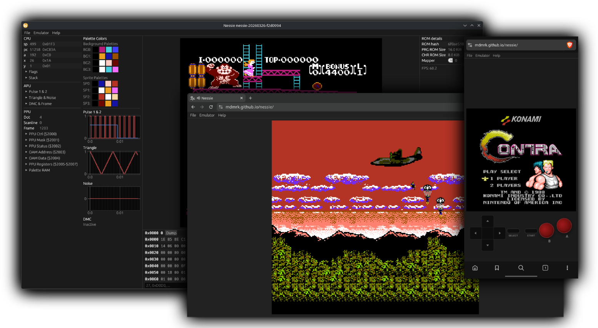

<div align="center">
  <br><br>

  # nessie

  Nintendo Entertainment System emulator and debugger

  [](https://github.com/mdmrk/nessie/actions/workflows/main.yml)&nbsp;
  [](https://github.com/mdmrk/nessie/releases/latest)&nbsp;
  [](https://github.com/mdmrk/nessie/releases)

  **[▶&nbsp; Try in Browser](https://mdmrk.github.io/nessie)**
</div>

---

## Downloads

| Platform | Stable | Nightly |
|----------|:------:|:-------:|
| 🪟 Windows x64 | [zip ↓](https://github.com/mdmrk/nessie/releases/latest/download/nessie-windows-x64.zip) | [zip ↓](https://github.com/mdmrk/nessie/releases) |
| 🍎 macOS x64 | [zip ↓](https://github.com/mdmrk/nessie/releases/latest/download/nessie-macos-x64.zip) | [zip ↓](https://github.com/mdmrk/nessie/releases) |
| 🍎 macOS ARM64 | [zip ↓](https://github.com/mdmrk/nessie/releases/latest/download/nessie-macos-arm64.zip) | [zip ↓](https://github.com/mdmrk/nessie/releases) |
| 🐧 Linux x64 | [zip ↓](https://github.com/mdmrk/nessie/releases/latest/download/nessie-linux-x64.zip) | [zip ↓](https://github.com/mdmrk/nessie/releases) |

Nightly builds track the latest commit on `main` and supersede the previous prerelease.

---

## Build

**Prerequisites:** [Rust](https://rustup.rs) stable toolchain. On Linux, also install the ALSA and udev development libraries:

```sh
# Debian/Ubuntu
sudo apt install libasound2-dev libudev-dev pkg-config
```

**Native:**

```sh
cargo build --release
```

**Web** ([trunk](https://trunkrs.dev) required):

```sh
trunk build --release --cargo-profile release-wasm
```

---

## Features

- 6502 CPU, PPU, and APU emulation
- iNES cartridge format - mappers: 0 (NROM), 1 (MMC1), 2 (UxROM)
- Built-in debugger
- Save states
- Native (Windows, macOS, Linux) and Web (WebAssembly)

---

## Usage

```
Usage: nessie [<rom>] [-p] [-l] [-v] [--portable]

Nintendo NES emulator and debugger

Positional Arguments:
  rom               path to the ROM file (.nes)

Options:
  -p, --pause       start emulation paused
  -l, --log         enable CPU instruction logging
  -v, --version     print version and exit
  --portable        store config and cache in the working directory
  -h, --help        display usage information
```
